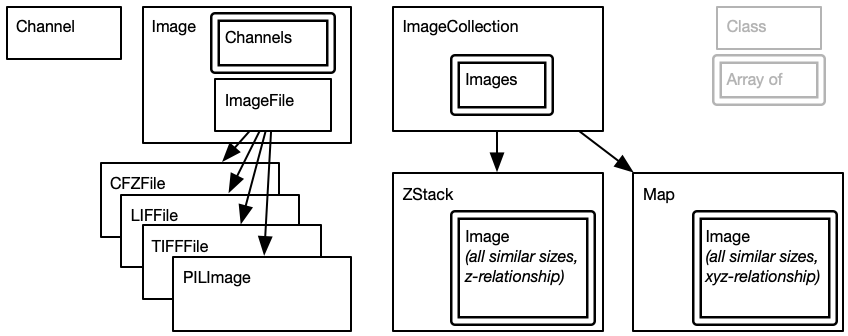

# CERVO-dcclab Python module

This simple module is meant to simplify the loading and treatment of images at CERVO. The ultimate goal of this module is to rapidly be able to extract useful and pertinent information about microscopy images taken at the CERVO research center.

## Image-oriented API

The first API, for users, is said to be "image-oriented".  This is likely going to be the most used API: I have an image, show me the filtered image, the z-stack or segement this collection of images.  *It must be expressed in a natural language for people who deal with images.* An `Image()` keeps an internal reference (hidden) to a `ImageFile`.  

## File-oriented API

Sometimes however, a user has a specific file and needs to comb through all the data it contains.  For instance, a Carl-Zeiss File (`.czi`) contains several images and Leica file (`.lif`) can contain several stacks and time series.  Hence, in this particular case, it become very much application-specific.  An file-oriented API uses the file as the source and can return Images, zStacks, TimeSeries, etc… contained in the file. An `ImageFile` can be created independently, and methods exist to obtain `ImageData`, `ImageStackData`, etc...

## Class hierarchy

## Coding style

The coding style for the group is available [online](https://github.com/DCC-Lab/Documentation/blob/master/HOWTO-CodingStyle.md). However, we highlight important aspects here:

1. Plan for usage, not for coders.

2. The code should read as a text.
   Variable names and function names are important. A boolean variable can be called `isDone`. A table representing an image can be called `image`. A function can have an action verb in its name. 

3. We do not need to use "array" in the name to describe an array, because it could be an array, a list, a set. We use th eplural form instead. For instance, in `Image`, the channels are kept in `Image().channels`, which happens to be a list. In `ImageCollection`, the images are in `images`.

4. We take a "camel-case" style, that is, the first letter is lowercase, and then each word is capitalized, as in `createRayPlot()`. We never use underscores (_) which are reserved for internal, hidden, private, low-level variables.

5. Properties must be declared with `@property`.

6. Functions shoudl have an action word (`applyFilter`).  If we "get" something, we use the name without `get` (i.e. `imageData`).  When we set something that is not a property, we use `set` (i.e. `setPermissionToReadOnly`)

7. Always expose as little as possible.

   